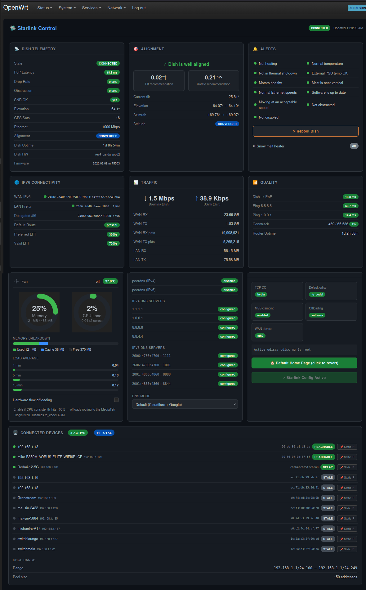

# luci-app-starlink

LuCI dashboard for Starlink dish telemetry, alignment, alerts, IPv6 connectivity, traffic, and router configuration on OpenWrt 25.x.
Works with Starlink Gen3 and higher dish



---

## Features

- **Dish Telemetry** — state, uptime, latency, packet drop, obstruction %, throughput, SNR, GPS satellites, Ethernet speed, hardware/software version
- **Alignment** — tilt and rotation guidance (↑↓ / ↻↶) with "well aligned" confirmation
- **Alerts** — 11 health indicators matching the Starlink app (heating, thermal throttle, shutdown, PSU throttle, motors, mast, slow Ethernet, software update, roaming, obstruction, disabled); snow melt heater mode status; **Reboot Dish** button
- **IPv6 Connectivity** — WAN address, LAN address, delegated /56 prefix, default route, odhcpd lifetime status
- **Traffic** — WAN and LAN byte/packet counters
- **Quality** — latency to 8.8.8.8 / 1.0.0.1, conntrack usage, router uptime
- **DNS Servers** — IPv4 and IPv6 DNS server list with peerdns status; **DNS Mode selector** dropdown to switch between Default (Cloudflare + Google), Starlink (ISP DNS), Family Filter (Cloudflare for Families — blocks malware + adult content), and Malware Filter (Cloudflare malware-only)
- **Configuration** — TCP congestion control, qdisc, flow offloading, MTU fix, DHCPv6-PD lifetime settings; **Turn Starlink Config On** and **Set as Default Home Page** buttons
- **Router Stats** — CPU load gauges, memory usage bar, load averages; animated fan speed indicator with CPU temperature; **hardware flow offloading toggle** (detects NPU from board target)
- **Connected Devices** — full-width scrollable device list with hostname, IP, MAC, active/stale state, DHCP range, and **per-device static IP assignment** (set or remove with one click)
- **Turn Starlink Config On** button — applies full optimal Starlink IPv6 config (DHCPv6-PD, odhcpd lifetime fix, DNS, NTP, firewall, kernel tuning) with one click; shows green "✓ Starlink Config Active" when all settings are verified, reverts if any setting drifts
- **Set as Default Home Page** button — makes the Starlink dashboard the first page seen after login; click again to revert

Auto-refreshes every 10 seconds.

Note: The alignment data provided is direct from the dish API and after confirming with star-link support is more accurate than the phone app that incorrectly reports over 6 degrees misalignment and should be ignored if the dish reports its aligned.
---

## One-Click Optimal Starlink IPv6 Configuration

The **Configuration** card includes a **Turn Starlink Config On** button that applies the full recommended OpenWrt setup for Starlink residential with a single click — no SSH or command line needed.

### What it configures

| Area | Setting |
|------|---------|
| **IPv6 WAN** | DHCPv6-PD with `reqprefix=auto`, `ip6assign=64`, `peerdns=0` |
| **odhcpd prefix lifetimes** | `max_preferred_lifetime=3600`, `max_valid_lifetime=7200` — fixes Starlink's ~129s/~279s prefix lifetimes that cause constant IPv6 address churn on LAN clients |
| **DNS** | Cloudflare (1.1.1.1 / 1.0.0.1) + Google (8.8.8.8 / 8.8.4.4), IPv4 and IPv6, peerdns disabled |
| **NTP** | Adds Starlink dish (`192.168.100.1`) as GPS Stratum 1 source (~85–123µs accuracy) |
| **Firewall** | Software flow offloading enabled, hardware offloading disabled (keeps fq_codel active), MSS clamping (`mtu_fix=1`) for both ingress and egress |
| **TCP congestion control** | `hybla` (satellite-optimised, RTT-compensating) with automatic fallback to CDG → BBR → cubic |
| **Kernel / sysctl** | `fq_codel` default qdisc, `tcp_fastopen=3`, `tcp_mtu_probing=2`, `accept_ra=2` (required for IPv6 when forwarding=1), conntrack timeouts from official Starlink Gen2 firmware |

### Button states

| State | Meaning |
|-------|---------|
| 🔵 **Turn Starlink Config On** | Config not yet applied, or a setting has been changed since last apply |
| 🟡 **⟳ Applying…** | Script running in background (~30–45s) |
| 🟢 **✓ Starlink Config Active** | All settings verified correct |

The dashboard checks the configuration on every 10-second refresh. If any watched setting is changed (via LuCI, UCI, or SSH), the button reverts to blue within 10 seconds so you can re-apply.

---

## Related

The setup script from [starlink-openwrt-ipv6-optimized](https://github.com/bigmalloy/starlink-openwrt-ipv6-optimized) is now bundled directly in this APK as `/usr/bin/starlink-setup`. The **Turn Starlink Config On** button runs it for you — no need to download or run it manually. The companion repo remains a useful reference for the reasoning behind each setting.

---

## Requirements

| Requirement | Notes |
|-------------|-------|
| OpenWrt 25.x | Uses `apk` package manager; tested on 25.12.0 |
| Architecture | `aarch64_cortex-a53` (GL-iNet Beryl AX / MT3000) — PKGARCH=all so works anywhere |
| `luci-base` | LuCI web interface |
| `rpcd` | RPC daemon (usually pre-installed) |
| `jsonfilter` | JSON parser for shell scripts |
| `starlink-dish` | Required for dish telemetry — **installed automatically on aarch64** during `apk add` (downloaded to `/usr/bin/starlink-dish`). 1.4 MB static Rust binary; replaces grpcurl from v2.1-r5. |

---

## Installation

### Verified install (recommended)

```sh
# 1. Add signing key (one-time)
wget -O /etc/apk/keys/luci-fancontrol-signing.pub \
  https://github.com/bigmalloy/openwrt-starlink-control/releases/latest/download/luci-fancontrol-signing.pub

# 2. Install APK
wget -O /tmp/luci-app-starlink.apk \
  https://github.com/bigmalloy/openwrt-starlink-control/releases/latest/download/luci-app-starlink-2.1-r5.apk
apk add /tmp/luci-app-starlink.apk
```

### Quick install (skip signature check)

```sh
wget -O /tmp/luci-app-starlink.apk \
  https://github.com/bigmalloy/openwrt-starlink-control/releases/latest/download/luci-app-starlink-2.1-r5.apk
apk add --allow-untrusted /tmp/luci-app-starlink.apk
```

The post-install script automatically downloads `starlink-dish` and restarts `rpcd` and `uhttpd`. Navigate to **Network → Starlink** in the LuCI menu.

If the automatic download fails (no internet at install time), run `/usr/bin/install-grpcurl` once the router has connectivity.

### Manual binary install (if postinst download fails)

```sh
wget -O /usr/bin/starlink-dish \
  https://github.com/bigmalloy/starlink-panel/releases/latest/download/starlink-dish
chmod +x /usr/bin/starlink-dish
```

---

### Release notes

> **v2.1-r5** — Replaced `grpcurl` with [`starlink-dish`](https://github.com/bigmalloy/starlink-panel), a purpose-built 1.4 MB Rust gRPC client. Outputs flat JSON directly — no shell parsing overhead. If upgrading from an earlier version, the postinst will remove grpcurl and install starlink-dish automatically.
>
> **v2.1-r4** — Connected Devices sort toggle: click the **active** badge for active-first order, click **total** for stable alphabetical order. Sort persists across auto-refresh.
>
> **v2.1-r3** — Fixed static IP detection for VLAN hostnames; two-button static IP UX (set / remove as separate actions).
>
> **v2.1-r2** — Auto-detects LuCI theme (reads computed background luminance) for accurate dark/light card styling regardless of OS preference.
>
> **v2.1** — Version number shown in header title; versioned APK filename.
>
> **v1.0.0-r10** — Router Stats card shows an **animated fan icon** with current fan speed (state/max) and CPU temperature, colour-coded by temperature.
>
> **v1.0.0-r9** — Connected Devices supports **static IP assignment** — click 📌 next to any device to pin its IP. Router Stats includes a **hardware flow offloading toggle** with NPU name detected from board target.
>
> **v1.0.0-r8** — DNS card includes a **DNS Mode selector** — switch between Default, Starlink (ISP), Family Filter, and Malware Filter with one click.
>
> **v1.0.0-r7** — DNS Servers, Connected Devices (with DHCP range), Router Stats, and Set as Default Home Page button added.
>
> **v1.0.0-r6** — **Turn Starlink Config On** button applies full recommended Starlink IPv6 setup from LuCI — no SSH needed.
>
> **v1.0.0-r5** — Dish telemetry binary installed automatically during `apk add`.

---

## Build from Source

Requires Docker.

```sh
git clone https://github.com/bigmalloy/openwrt-starlink-control
cd openwrt-starlink-control
./build-apk-docker.sh
# Output: output/luci-app-starlink-*.apk
```

The build uses the official `openwrt/sdk:aarch64_cortex-a53-25.12.0-rc5` Docker image.

---

## Hardware Tested

| Device | GL-iNet Beryl AX (MT3000) |
|--------|---------------------------|
| SoC | MediaTek MT7981B |
| OpenWrt | 25.12.0 |
| Starlink | Gen3 dish (rev4_panda_prod2) |
| ISP | Starlink Residential (AU) |

---

## Buy me a beer

If this project saved you some time, feel free to shout me a beer!

[](https://paypal.me/bergfirmware)

---

## License

MIT
